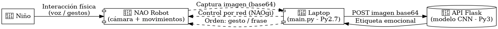
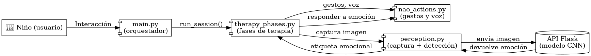
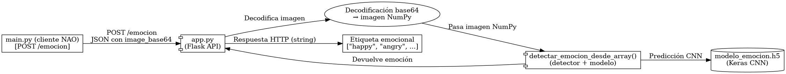
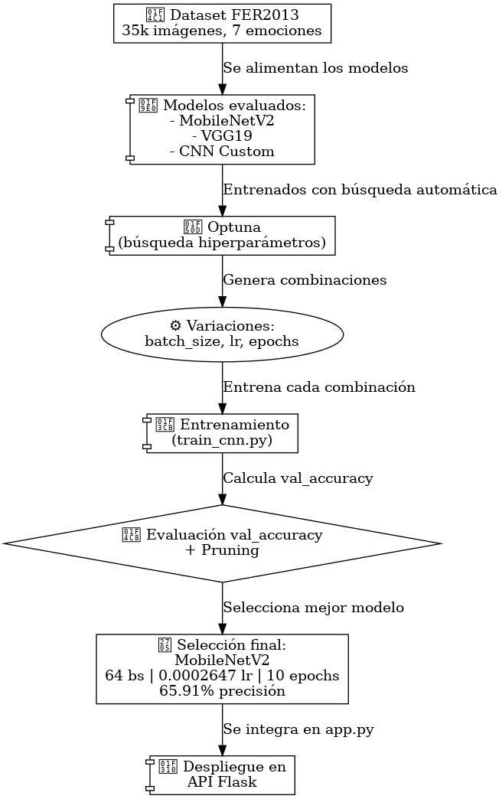

# NAO_FER_CNN

## Introduccion

Este proyecto implementa un sistema de detección de emociones con visión por computadora para el robot NAO, enfocado en apoyar a niños con autismo (TEA). Usa CNNs integradas vía Flask para que NAO responda con gestos y voz según la emoción detectada. El sistema se validará en pruebas reales en el FabLab, demostrando una aplicación práctica de IA en robótica social con fines psicoeducativos.

**Objetivo general:**
Crear un sistema de IA que detecte emociones faciales desde la cámara del NAO y adapte su voz y gestos según el resultado, para apoyar a niños con TEA.

**Objetivos específicos:**

* Comparar arquitecturas e implementaciones de CNNs y elegir el más eficiente para integrarlo con NAO vía Flask.
* Validar el sistema con niños en el FabLab, observando respuestas naturales.
* Documentar todo el proceso para que sea replicable en otros entornos.

## Desarrollo

El sistema conecta al robot NAO con una API Flask que detecta emociones faciales y le indica cómo responder. La arquitectura tiene cuatro componentes principales:

1. API Flask (Luis):
NAO captura la imagen del usuario y la expone a un servidor Flask externo con mayor capacidad de cómputo. Este servidor procesa la imagen, ejecuta el modelo de clasificación emocional y devuelve la predicción. Luego, NAO interpreta esta respuesta para ejecutar gestos y frases acordes al estado emocional detectado.

2. Modelos de IA (Rody):
   Se entrenaron modelos segun las arquitecturas MobileNetV2, VGG19 y un CNN Custom (enfocado en velocidad de inferencia). Se implemento una busqueda de hiperparmetros mediante `optuna` para optimizar la precision de los modelos. Finalmente se selecciono el modelo `MobileNetV2, con un  batch_size: 64, tasa de aprendizaje: 0.2647x10-3, epochs: 10 que obtuvo una presion de 65,91%. Para la prediccion multivariada de las 7 categorias emocionales del FER2013 (35.000 obs).

   Se implemento el servidor de Flask Host donde se recibe la imagen y se preprocesa con un modelo prentenado para la deteccion de rostros, usado para realizar la prediccion entregando la etiqueta mas probable al cliente Flask que establece la comunicacion con NAO.

3. Validación con usuarios (Willian):
   Se probo en el FabLab

4. Documentación y coordinación (Alejandro):
   Se documentó todo el proceso 

## Flujo del sistema

El flujo del sistema es:

1. El NAO captura una imagen desde su cámara frontal.
2. La imagen se codifica en base64 y se envía vía HTTP a una API Flask.
3. Un modelo de ML en la laptop analiza la emoción facial en la imagen.
4. La respuesta emocional se devuelve al NAO, que reacciona con voz y gestos expresivos.


## Tecnologías utilizadas

- **Robot**: NAO (versión con Python 2.7)
- **API backend**: Flask (Python 3.10)
- **Modelos**:
  - CNN (MobileNetV2 / VGG19)
  - Keypoints faciales (MediaPipe + MLP)
  - Keypoints posturales (MediaPipe Pose + MLP)
- **Librerías**:
  - `pynaoqi`
  - `Flask`, `NumPy`, `OpenCV`, `Pillow`
  - `MediaPipe`, `scikit-learn`, `PyTorch`
- **Comunicación**: HTTP simple (sin sockets ni ROS)

## Estructura del repositorio

```
NAO/
├── apiflask/                 # Carpeta con backend Flask en Py3 (uso demodelo y API)
├── data/                     # Datasets originales o preprocesados
│   ├── fer2013/              # csv, img sueltas
│   └── test_imgs/            # Para pruebas en notebooks
├── models/                   # Modelos guardados (.pt, .h5, etc.)
│   ├── modelo_emocion.h5
│   ├── cnn/  
│   ├── keypoints_f/
│   └── keypoints_p/
├── notebooks/                # Experimentos y pruebas manuales
│   ├── logs/
│   └── 001_test_model1.ipynb ...
├── scripts/                  # Código fuente general
│   ├── train/                # Entrenamiento de modelos
│   │   ├── train_cnn.py
│   │   ├── train_keypoints_f.py
│   │   └── train_keypoints_p.py
│   ├── models/               # Definición de arquitecturas
│   │   ├── cnn.py
│   │   └── classifiers.py    # MLP / SVM para keypoints
│   ├── extractors/           # Extracción de features
│   │   ├── face_keypoints.py
│   │   └── pose_keypoints.py
│   ├── evaluate.py           # Evaluación y comparación
│   ├── preprocess.py         # Resize, grayscale, crop, etc.
│   └── utils.py              # Métricas, visualización, timers
├── main.py                 # Script que corre en NAO (Py2.7)
├── run.sh                    # Script de ejecución rápida
├── requirements_backend.txt
├── requirements_nao.txt
├── pynaoqi-python2.7-2.8.6.23-linux64-20191127_152327/
└── README.md       
```

## 🛠️ Instalación

### Requisitos

* Tener instalado [Conda](https://docs.conda.io/en/latest/miniconda.html)
* Clonar el repositorio y acceder a la carpeta del proyecto

```bash
git clone https://github.com/R0SEWT/NAO_CNN_EMOTION_CLASSIFICATION.git
cd NAO_CNN_EMOTION_CLASSIFICATION
```

### Instalación rápida con script

Ejecuta el script `setup.sh` para crear automáticamente los entornos y dejar todo listo:

```bash
chmod +x setup.sh
./setup.sh
```

Esto crea:

* `nao_py27`: entorno con Python 2.7 y dependencias del NAO
* `nao_sv`: entorno principal con dependencias de la API Flask

---

## ▶️ Uso

1. Activar el entorno:

```bash
conda activate nao_sv
```

2. Ejecutar la API Flask en la laptop:

```bash
python api_emocion.py
```

3. Ejecutar el script en el NAO (verifica que la IP esté configurada):

```bash
./run.sh
```

---


## 🧪 Pruebas

Se realizaron pruebas de usabilidad en el fablab logrando predecir la emocion en los rostros de los participantes

## 📚 Enfoque académico

Se busca explorar cómo los sistemas de detección emocional pueden integrarse en contextos de robótica social como herramientas de soporte para niños con TEA, siguiendo enfoques vicarios.

Este proyecto se enmarca como investigación aplicada de carácter comparativo, contribuyendo al análisis de técnicas de visión por computadora para contextos sociales asistidos. Se integrara una validación práctica con niños autistas en el FabLab de la universidad, aportando evidencia preliminar sobre la viabilidad técnica y pedagógica del enfoque.


##  Diagrama de flujo del sistema (NAO)

### 🧠 Diagrama Lógico (alto nivel)
<p align="center">
  
</p>

### 🛠️ Diagrama Técnico (estructura del sistema)
<p align="center">
  
</p>


---

### 🤖 Clasificador de Emociones (Flask + CNN)

Este componente está implementado en Python 3 con Flask y usa un modelo `.h5` entrenado con Keras para clasificar emociones faciales.

#### 📥 Flujo de la API:

1. `main.py` (Python 2.7) envía una imagen codificada en base64 mediante un POST a `/emocion`.
2. `app.py` (Flask) decodifica la imagen y la convierte a un arreglo NumPy.
3. Se llama a `detectar_emocion_desde_array()` para detectar el rostro y clasificar la emoción con un modelo CNN.
4. La emoción se devuelve como un string plano: `"happy"`, `"angry"`, `"neutral"`, etc.

<p align="center">
  
</p>


### 🧪 Entrenamiento y Optimización del Modelo CNN

El entrenamiento del clasificador emocional se realiza utilizando PyTorch y Optuna para búsqueda de hiperparámetros con pruning. Se exploran tres arquitecturas: `mobilenet`, `vgg19` y un modelo `custom` basado en CNNs simples.

#### 🔍 Proceso de optimización:

- Se prueban diferentes combinaciones de `batch_size` y `learning_rate`.
- Se ejecutan múltiples `trials` usando `optunahub.AutoSampler` y `MedianPruner`.
- Se entrena cada modelo con el script `train_cnn.py`.
- Se reporta el accuracy de validación (`val_accuracy`) en cada epoch.
- Los trials con bajo rendimiento son descartados anticipadamente.

#### 🧠 Modelos probados:
- **MobileNetV2**
- **VGG19**
- **Custom CNN** (3 conv layers + dense)

#### 💾 Guardado:
El mejor modelo se guarda automáticamente como `.pt` 

```
models/{nombre_modelo}_trial{número}_best.pt
```

Esto permite integrarlo directamente en la API Flask para la detección en tiempo real.

<p align="center">
  
</p>

📁 Carpeta de datos usada:  
`/data/kers2013/` (basado en FER2013, preprocesado)

📦 Librerías clave:
- `optuna`, `optunahub`, `torch`, `tqdm`, `matplotlib`, `pandas`

---


* Código e instrucciones: [GitHub - Rama `dev`](https://github.com/R0SEWT/NAO_CNN_EMOTION_CLASSIFICATION)
* Video de validación: [Carpeta en Drive](https://drive.google.com/drive/folders/1DG2ZNvtWSc58up8ZPChyiAcdMsj9ewC_?usp=sharing)

**Diagrama del sistema:**
[Ver en Miro](https://miro.com/welcomeonboard/TThFWUh4b1c0MG5pZXQrK3dJMWMzNGp1dkxFcEFoQnRMQWVxekVnMTBadGtvWHVmZnFPQnFEQkZYREJiWEVTMW5nNHNwU1laQ1hyWWJUMXI4V0cweEtkV1AyK1NZY3JSNXRCd2pmaHNmditRSHVFSWJXeXFtSjM5NDh0QkxTTW93VHhHVHd5UWtSM1BidUtUYmxycDRnPT0hdjE=?share_link_id=167565500588)
