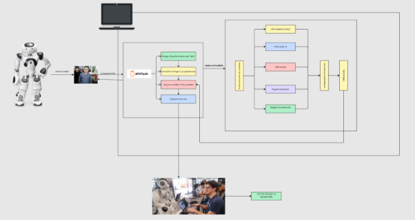

**Universidad Peruana de Ciencias Aplicadas**

**Machine Learning**

**Ciclo:** 2025-1

**Docente:** Jairo Pinedo Taquia

**Practica Calificada 3**

**Integrantes:**

- Jose Alejandro Loyola Huamán - U202110078
- Willam Alexander Huamán Saavedra  - U20211E088
- Rody Sebastián Vílchez Marín - u202216562
- Luis Enrique Zegarra García - U202123273

**INTRODUCCIÓN**

   En los últimos años, la inteligencia artificial ha revolucionado diversos campos de aplicación, incluyendo la robótica social y la educación personalizada. Una de las áreas con mayor impacto es la detección de emociones mediante visión por computadora, especialmente en contextos donde la interacción humano-robot puede tener un valor terapéutico o pedagógico.

   El presente proyecto, titulado “NAO Emotion Detection System”, tiene como propósito implementar un sistema de reconocimiento emocional basado en aprendizaje automático que permita al robot humanoide NAO reaccionar con gestos y respuestas verbales en función de la emoción detectada en el rostro de un usuario. Este sistema está orientado a brindar apoyo psicoeducativo a niños con Trastorno del Espectro Autista (TEA), aprovechando las capacidades expresivas del robot para facilitar interacciones sociales empáticas y no invasivas.

   El desarrollo del sistema se basa en el uso de modelos de redes neuronales convolucionales (CNN), integrados a través de una API Flask que actúa como intermediaria entre el modelo de IA (ejecutado en una laptop) y el robot NAO (que opera con Python 2.7). Se considera, además, la validación del sistema en condiciones reales dentro del FabLab de la universidad, lo que permite evaluar tanto el rendimiento técnico como la utilidad pedagógica de la solución.

   Esta implementación representa un ejemplo claro de cómo la inteligencia artificial puede integrarse de forma práctica en un entorno robótico real, cumpliendo el objetivo académico de demostrar que un agente inteligente puede ejecutar acciones condicionadas a los resultados de un modelo de IA.

**OBJETIVO**
   #### **Objetivo general**
   Desarrollar e integrar un sistema de inteligencia artificial capaz de detectar emociones faciales a partir de imágenes capturadas por el robot NAO, y condicionar su comportamiento expresivo (voz y gestos) en función del resultado obtenido, con el fin de explorar su aplicabilidad como herramienta de apoyo psicoeducativo para niños con Trastorno del Espectro Autista (TEA).
   #### **Objetivos específicos**
- Evaluar y comparar distintos enfoques de reconocimiento emocional, incluyendo modelos basados en CNNs y clasificadores de keypoints faciales y posturales, bajo condiciones controladas.\
  Implementar la técnica con mejor desempeño (precisión, velocidad y robustez) en un sistema distribuido entre el robot NAO y un backend Flask externo.
- Validar experimentalmente el sistema en interacciones reales con niños dentro del FabLab de la universidad, observando la naturalidad de la respuesta del robot y la reacción de los usuarios.
- Documentar el proceso de integración y configuración del modelo en el entorno operativo del robot NAO, asegurando su portabilidad y replicabilidad.**\

**DIAGRAMA DE ARQUITECTURA DE COMPONENTES DE LA IMPLEMENTACIÓN** 

   El sistema desarrollado se basa en una arquitectura modular que conecta al robot humanoide NAO con una API de inteligencia artificial encargada de la detección de emociones, integrando componentes de captura, procesamiento, predicción y validación. A continuación, se describe el flujo general del sistema según el rol de cada integrante:

   

   **Enlace del diagrama** 

   [**https://miro.com/welcomeonboard/TThFWUh4b1c0MG5pZXQrK3dJMWMzNGp1dkxFcEFoQnRMQWVxekVnMTBadGtvWHVmZnFPQnFEQkZYREJiWEVTMW5nNHNwU1laQ1hyWWJUMXI4V0cweEtkV1AyK1NZY3JSNXRCd2pmaHNmditRSHVFSWJXeXFtSjM5NDh0QkxTTW93VHhHVHd5UWtSM1BidUtUYmxycDRnPT0hdjE=?share_link_id=167565500588](https://miro.com/welcomeonboard/TThFWUh4b1c0MG5pZXQrK3dJMWMzNGp1dkxFcEFoQnRMQWVxekVnMTBadGtvWHVmZnFPQnFEQkZYREJiWEVTMW5nNHNwU1laQ1hyWWJUMXI4V0cweEtkV1AyK1NZY3JSNXRCd2pmaHNmditRSHVFSWJXeXFtSjM5NDh0QkxTTW93VHhHVHd5UWtSM1BidUtUYmxycDRnPT0hdjE=?share_link_id=167565500588)** 

   **Explicación**

   **API Flask – Procesamiento de Imagen**

   Responsable: Luis – Técnico principal

   La API, implementada con Flask, cumple los siguientes pasos:

- Recibe la imagen codificada desde NAO.
- Decodifica la imagen base64 y la convierte en un arreglo NumPy.
- Preprocesa la imagen (escala de grises, redimensionamiento, normalización).
- Llama al modelo .h5 entrenado previamente (CNN propia).
- Obtiene la emoción predicha y la devuelve como respuesta en formato texto (por ejemplo, "happy", "angry", etc.).

### **Modelos de IA – Clasificación de Emociones**
**Responsable:** Rody – Modelos y datos

Durante el proceso de experimentación, se entrenaron y compararon múltiples enfoques de detección emocional:

- **CNNs preentrenadas:** MobileNetV2 y VGG19.
- **CNN propia:** diseñada con tres capas convolucionales y capas densas.
- **Modelos alternativos:** Keypoints faciales y posturales extraídos con OpenCV/MediaPipe.

Cada uno fue evaluado en términos de **precisión**, **tiempo de respuesta** y **robustez**, y finalmente se eligió la **CNN propia**, la cual fue exportada en formato .h5 y desplegada en producción a través de la API Flask.
### **Interacción y Validación con Usuarios**
**Responsable:** Willian – Interacción y validación

Una vez detectada la emoción, esta es enviada de vuelta al robot NAO. Según la emoción recibida, el robot ejecuta una respuesta expresiva (como gestos, frases o movimientos corporales). Estas reacciones fueron validadas en una sesión práctica con niños, permitiendo observar la naturalidad de la interacción y evaluar la eficacia del sistema.
### **Documentación y Coordinación**
**Responsable:** Alejandro – Documentación y organización

Finalmente, todos los avances fueron registrados en informes técnicos y organizados en versiones controladas del código. Alejandro también coordinó la integración de módulos y documentación para facilitar futuras extensiones del sistema.

**INSTRUCCIONES DE INSTALACIÓN DEL MODELO DE IA EN EL ROBOT NAO**

   **Enlace del Git Hub donde se encuentra todas las instrucciones, en la rama dev se ha hecho el merge** 

   <https://github.com/R0SEWT/NAO_CNN_EMOTION_CLASSIFICATION> 

   **Enlace de la carpeta donde se ubica el video:**

   <https://drive.google.com/drive/folders/1DG2ZNvtWSc58up8ZPChyiAcdMsj9ewC_?usp=sharing>
