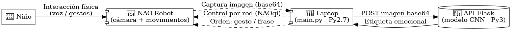
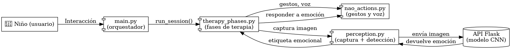
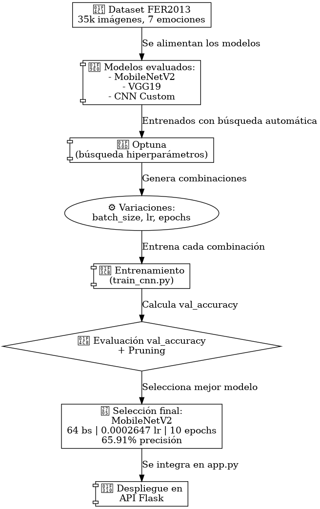

# NAO_FER_CNN

## Introduccion

Este proyecto implementa un sistema de detección de emociones con visión por computadora para el robot NAO, enfocado en apoyar a niños con autismo (TEA). Usa CNNs integradas vía Flask para que NAO responda con gestos y voz según la emoción detectada. El sistema se validará en pruebas reales en el FabLab, demostrando una aplicación práctica de IA en robótica social con fines psicoeducativos.

**Objetivo general:**
Crear un sistema de IA que detecte emociones faciales desde la cámara del NAO y adapte su voz y gestos según el resultado, para apoyar a niños con TEA.

**Objetivos específicos:**

* Comparar arquitecturas e implementaciones de CNNs y elegir el más eficiente para integrarlo con NAO vía Flask.
* Validar el sistema en el FabLab, observando respuestas naturales.
* Documentar todo el proceso para que sea replicable en otros entornos.

##  Diagrama de flujo del sistema (NAO)

### 🧠 Diagrama Lógico
<p align="center">
  
</p>

### 🛠️ Diagrama Técnico
<p align="center">
  
</p>


## Flujo del sistema

El flujo del sistema es:

1. El NAO captura una imagen desde su cámara frontal.
2. La imagen se codifica en base64 y se envía vía HTTP a una API Flask.
3. Un modelo de ML en la laptop analiza la emoción facial en la imagen.
4. La respuesta emocional se devuelve al NAO, que reacciona con voz y gestos expresivos.


## Tecnologías utilizadas

- **Robot**: NAO (versión con Python 2.7)
- **API backend**: Flask (Python 3.10)
- **Modelos**:
  - CNN (MobileNetV2 / VGG19)
  - Keypoints faciales (MediaPipe + MLP)
  - Keypoints posturales (MediaPipe Pose + MLP)
- **Librerías**:
  - `pynaoqi`
  - `Flask`, `NumPy`, `OpenCV`, `Pillow`
  - `MediaPipe`, `scikit-learn`, `PyTorch`
- **Comunicación**: HTTP simple (sin sockets ni ROS)

## Estructura del repositorio

```
.
├── apiflask/                    # API Flask para detección de emociones
│   ├── api_emocion.py          # Define los endpoints principales
│   ├── detectar_emocion.py     # Procesamiento y predicción desde imagen
│   ├── logs_img/               # Carpeta temporal para imágenes procesadas
│   ├── utils.py                # Funciones auxiliares
│   └── webcam_server.py        # Captura de imágenes desde webcam
│
├── config/
│   └── config.py               # Configuraciones generales del sistema
│
├── data/                       # Datasets y modelos entrenados
│   ├── fer2013/                # Dataset original (CSV o imágenes sueltas)
│   ├── kers2013/               # Dataset en estructura de carpetas
│   │   ├── train/              # Datos de entrenamiento organizados por clase
│   │   └── val/                # Datos de validación organizados por clase
│   ├── kers2013_sample_500_val20/  # Versión reducida del dataset (500 por clase)
│   │   ├── train/
│   │   └── val/
│   ├── models/                 # Modelos entrenados (.pt)
│   │   ├── *_final.pt          # Modelos finales entrenados manualmente
│   │   └── *_trialX_best.pt    # Mejores modelos de cada trial de Optuna
│   ├── README.md               # Documentación de los datasets usados
│   └── test_imgs/             # Imágenes para pruebas en notebooks
│
├── doc/                        # Material de documentación y diagramas
│   ├── arbol.txt              # Representación textual de la estructura
│   ├── *.png                  # Diagramas técnicos y lógicos del sistema
│
├── environment.yml            # Definición de entorno conda principal
│
├── logs/                       # Logs antiguos (puede consolidarse con notebooks/logs/)
│   └── train/
│       └── mobilenet/         # Logs por modelo (formato .csv y .log)
│
├── main.py                    # Script principal que corre en el NAO (Python 2.7)
│
├── models/                     # Carpeta de modelos (duplicado, sugerencia: consolidar)
│   ├── mobilenet_final.pt
│   ├── modelo_emocion.h5
│   ├── README.md
│   └── tasks.md
│
├── notebooks/                  # Experimentación y análisis
│   ├── 001_generate_tree.ipynb              # Genera estructura del proyecto
│   ├── 101_test_model_basic.ipynb           # Prueba básica del modelo
│   ├── 102_predict_multiple_images.ipynb    # Predicción en batch
│   ├── 103_predict_top3_emotions.ipynb      # Predicción top-3
│   ├── 104_predict_top3_with_logging.ipynb  # Predicción con logging
│   ├── 203_optuna_hyperparameter_search.ipynb # Optuna tuning
│   └── logs/                                # Logs de Optuna por modelo/trial
│       ├── <modelo>_trial<id>/              # Log de cada trial (log, csv, params)
│       └── *.csv, *.log, *_params.txt       # Resultados por prueba
│
├── pynaoqi-*.tar.gz           # SDK del robot NAO (Python 2.7)
│
├── readme.md                  # Descripción general del proyecto
├── requirements_nao.txt       # Requisitos del entorno NAO (Py2.7)
├── run.sh                     # Script de ejecución rápida
│
├── scripts/                   # Código fuente modular
│   ├── evaluate.py            # Evaluación de modelos
│   ├── extractors/            # Extracción de keypoints faciales y posturales
│   ├── logger_train.py        # Logger personalizado por epoch/trial
│   ├── models/                # Definición de modelos CNN
│   ├── nao/                   # Acciones del robot NAO
│   ├── perception/            # Detección y análisis de expresiones
│   ├── preprocess.py          # Preprocesamiento de imágenes
│   ├── sample_generator.py    # Generación de datasets reducidos
│   ├── therapy/               # Flujo lógico de la intervención
│   └── train/
│       └── train_cnn.py       # Entrenamiento y logging por trial
│
└── setup.sh                   # Instalación automática de entornos

```

## 🛠️ Instalación

### Requisitos

* Tener instalado [Conda](https://docs.conda.io/en/latest/miniconda.html)
* Clonar el repositorio y acceder a la carpeta del proyecto

```bash
git clone https://github.com/R0SEWT/NAO_CNN_EMOTION_CLASSIFICATION.git
cd NAO_CNN_EMOTION_CLASSIFICATION
```

### Instalación rápida con script

Ejecuta el script `setup.sh` para crear automáticamente los entornos y dejar todo listo:

```bash
chmod +x setup.sh
./setup.sh
```

Esto crea:

* `nao_py27`: entorno con Python 2.7 y dependencias del NAO
* `nao_sv`: entorno principal con dependencias de la API Flask

---

## ▶️ Uso

1. Activar el entorno:

```bash
conda activate nao_sv
```

2. Ejecutar la API Flask en la laptop:

```bash
python api_emocion.py
```

3. Ejecutar el script en el NAO (verifica que la IP esté configurada):

```bash
./run.sh
```

---


## 🧪 Pruebas

Se realizaron pruebas de usabilidad en el fablab logrando predecir la emocion en los rostros de los participantes

## 📚 Enfoque académico

Se busca explorar cómo los sistemas de detección emocional pueden integrarse en contextos de robótica social como herramientas de soporte para niños con TEA, siguiendo enfoques vicarios.

Este proyecto se enmarca como investigación aplicada de carácter comparativo, contribuyendo al análisis de técnicas de visión por computadora para contextos sociales asistidos. Se integrara una validación práctica en el FabLab de la universidad, aportando evidencia preliminar sobre la viabilidad técnica y pedagógica del enfoque.


---

### 🤖 Clasificador de Emociones (Flask + CNN)

Este componente está implementado en Python 3 con Flask y usa un modelo `.h5` entrenado con Keras para clasificar emociones faciales.

#### 📥 Flujo de la API:

1. `main.py` (Python 2.7) envía una imagen codificada en base64 mediante un POST a `/emocion`.
2. `app.py` (Flask) decodifica la imagen y la convierte a un arreglo NumPy.
3. Se llama a `detectar_emocion_desde_array()` para detectar el rostro y clasificar la emoción con un modelo CNN.
4. La emoción se devuelve como un string plano: `"happy"`, `"angry"`, `"neutral"`, etc.

<p align="center">
  
</p>


### 🧪 Entrenamiento y Optimización del Modelo CNN

El entrenamiento del clasificador emocional se realiza utilizando PyTorch y Optuna para búsqueda de hiperparámetros con pruning. Se exploran tres arquitecturas: `mobilenet`, `vgg19` y un modelo `custom` basado en CNNs simples.

#### 🔍 Proceso de optimización:

- Se prueban diferentes combinaciones de `batch_size` y `learning_rate`.
- Se ejecutan múltiples `trials` usando `optunahub.AutoSampler` y `MedianPruner`.
- Se entrena cada modelo con el script `train_cnn.py`.
- Se reporta el accuracy de validación (`val_accuracy`) en cada epoch.
- Los trials con bajo rendimiento son descartados anticipadamente.

#### 🧠 Modelos probados:
- **MobileNetV2**
- **VGG19**
- **Custom CNN** (3 conv layers + dense)

#### 💾 Guardado:
El mejor modelo se guarda automáticamente como `.pt` 

```
models/{nombre_modelo}_trial{número}_best.pt
```

Esto permite integrarlo directamente en la API Flask para la detección en tiempo real.

<p align="center">
  
</p>

📁 Carpeta de datos usada:  
`/data/kers2013/` (basado en FER2013, preprocesado)

📦 Librerías clave:
- `optuna`, `optunahub`, `torch`, `tqdm`, `matplotlib`, `pandas`

---


* Código e instrucciones: [GitHub - Rama `dev`](https://github.com/R0SEWT/NAO_CNN_EMOTION_CLASSIFICATION)
* Video de validación: [Carpeta en Drive](https://drive.google.com/drive/folders/1DG2ZNvtWSc58up8ZPChyiAcdMsj9ewC_?usp=sharing)

**Diagrama del sistema:**
[Ver en Miro](https://miro.com/welcomeonboard/TThFWUh4b1c0MG5pZXQrK3dJMWMzNGp1dkxFcEFoQnRMQWVxekVnMTBadGtvWHVmZnFPQnFEQkZYREJiWEVTMW5nNHNwU1laQ1hyWWJUMXI4V0cweEtkV1AyK1NZY3JSNXRCd2pmaHNmditRSHVFSWJXeXFtSjM5NDh0QkxTTW93VHhHVHd5UWtSM1BidUtUYmxycDRnPT0hdjE=?share_link_id=167565500588)
